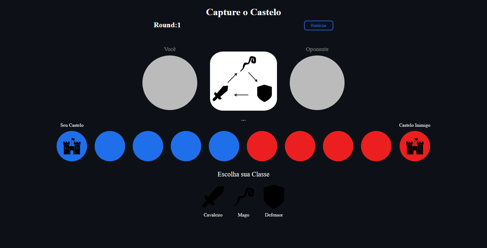

# Project Capture the Castle (paper, rock, scissors) 

This was a challenge project from The Odin Project, where the goal was to create a Rock, Paper, Scissors game. I decided to take the idea and adapt it into a Capture the Castle game, which follows the same logic but with a theme centered around conquering an enemy castle.

📧 Send me an email: henrykaua21@gmail.com 

🔗 Connect with me on [LinkedIn](https://www.linkedin.com/in/henry-kaua/)

🐛 Open an [issue](https://github.com/henrymzs/capture-the-castle/issues) in the repository 

Any help is greatly appreciated and contributes to my growth as a developer. 🚀

Result:

